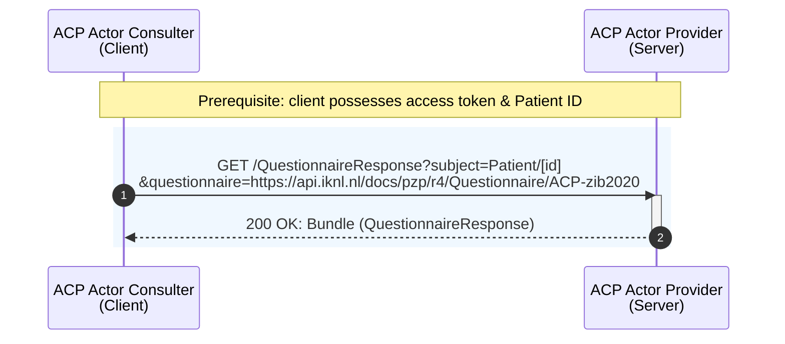

```mermaid
sequenceDiagram
    autonumber
    participant C as ACP Actor Consulter<br>(Client)
    participant S as ACP Actor Provider<br>(Server)

    note over C, S: Prerequisite: client possesses access token & Patient ID

    rect rgb(240, 248, 255)
        
        C->>S: GET /QuestionnaireResponse?subject=Patient/[id]<br>&questionnaire=https://api.iknl.nl/docs/pzp/r4/Questionnaire/ACP-zib2020
        activate S

        S-->>C: 200 OK: Bundle (QuestionnaireResponse)

        deactivate S
    end
```