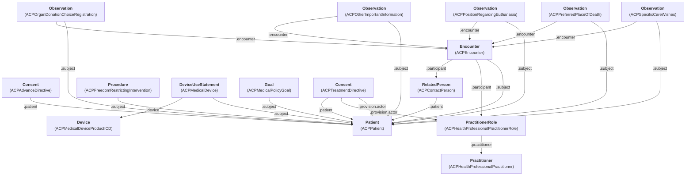

```mermaid
flowchart TB

    %% ---- Profile Definitions ----
    AdvanceDirective["`**Consent**<br>(ACPAdvanceDirective)`"]
    ContactPerson["`**RelatedPerson**<br>(ACPContactPerson)`"]
    Encounter["`**Encounter**<br>(ACPEncounter)`"]
    FreedomRestrictingIntervention["`**Procedure**<br>(ACPFreedomRestrictingIntervention)`"]
    HealthProfessionalPractitioner["`**Practitioner**<br>(ACPHealthProfessionalPractitioner)`"]
    HealthProfessionalPractitionerRole["`**PractitionerRole**<br>(ACPHealthProfessionalPractitionerRole)`"]
    MedicalDevice["`**DeviceUseStatement**<br>(ACPMedicalDevice)`"]
    MedicalDeviceProductICD["`**Device**<br>(ACPMedicalDeviceProductICD)`"]
    MedicalPolicyGoal["`**Goal**<br>(ACPMedicalPolicyGoal)`"]
    OrganDonationChoiceRegistration["`**Observation**<br>(ACPOrganDonationChoiceRegistration)`"]
    OtherImportantInformation["`**Observation**<br>(ACPOtherImportantInformation)`"]
    Patient["`**Patient**<br>(ACPPatient)`"]
    PositionRegardingEuthanasia["`**Observation**<br>(ACPPositionRegardingEuthanasia)`"]
    PreferredPlaceOfDeath["`**Observation**<br>(ACPPreferredPlaceOfDeath)`"]
    SpecificCareWishes["`**Observation**<br>(ACPSpecificCareWishes)`"]
    TreatmentDirective["`**Consent**<br>(ACPTreatmentDirective)`"]

    %% ---- Reference Definitions ----
    AdvanceDirective -- .patient --> Patient
    ContactPerson -- .patient --> Patient
    Encounter -- .participant --> ContactPerson
    Encounter -- .participant --> HealthProfessionalPractitionerRole
    Encounter -- .subject --> Patient
    FreedomRestrictingIntervention -- .subject --> Patient
    HealthProfessionalPractitionerRole -- .practitioner --> HealthProfessionalPractitioner
    MedicalDevice -- .device --> MedicalDeviceProductICD
    MedicalDevice -- .subject --> Patient
    MedicalPolicyGoal -- .subject --> Patient
    OrganDonationChoiceRegistration -- .encounter --> Encounter
    OrganDonationChoiceRegistration -- .subject --> Patient
    OtherImportantInformation -- .encounter --> Encounter
    OtherImportantInformation -- .subject --> Patient
    PositionRegardingEuthanasia -- .encounter --> Encounter
    PositionRegardingEuthanasia -- .subject --> Patient
    PreferredPlaceOfDeath -- .encounter --> Encounter
    PreferredPlaceOfDeath -- .subject --> Patient
    SpecificCareWishes -- .encounter --> Encounter
    SpecificCareWishes -- .subject --> Patient
    TreatmentDirective -- .patient --> Patient
    TreatmentDirective -- .provision.actor --> HealthProfessionalPractitionerRole
    TreatmentDirective -- .provision.actor --> Patient
```
