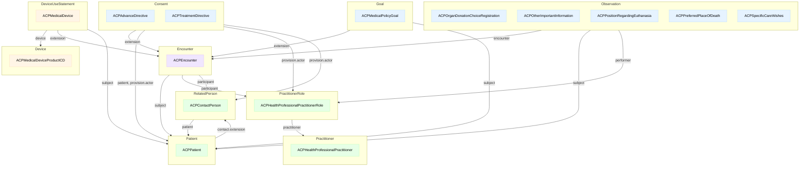

```mermaid
flowchart TB

    %% ---- Style Definitions for Categories ----
    classDef C0 fill:#e6f3ff,stroke:#b3d9ff,color:#000
    classDef C1 fill:#e6ffe6,stroke:#b3ffb3,color:#000
    classDef C2 fill:#fff5e6,stroke:#ffddb3,color:#000
    classDef C3 fill:#f0e6ff,stroke:#d9b3ff,color:#000
    classDef C4 fill:#f2f2f2,stroke:#cccccc,color:#000

    %% ---- Subgraph Definitions ----
    subgraph "Consent"
        direction TB
        ACPAdvanceDirective
        ACPTreatmentDirective
    end

    subgraph "Device"
        direction TB
        ACPMedicalDeviceProductICD
    end

    subgraph "DeviceUseStatement"
        direction TB
        ACPMedicalDevice
    end

    subgraph "Encounter"
        direction TB
        ACPEncounter
    end

    subgraph "Goal"
        direction TB
        ACPMedicalPolicyGoal
    end

    subgraph "Observation"
        direction TB
        ACPOrganDonationChoiceRegistration
        ACPOtherImportantInformation
        ACPPositionRegardingEuthanasia
        ACPPreferredPlaceOfDeath
        ACPSpecificCareWishes
    end

    subgraph "Patient"
        direction TB
        ACPPatient
    end

    subgraph "Practitioner"
        direction TB
        ACPHealthProfessionalPractitioner
    end

    subgraph "PractitionerRole"
        direction TB
        ACPHealthProfessionalPractitionerRole
    end

    subgraph "RelatedPerson"
        direction TB
        ACPContactPerson
    end

    %% ---- Style Assignments ----
    class ACPAdvanceDirective C0
    class ACPTreatmentDirective C0
    class ACPMedicalDeviceProductICD C2
    class ACPMedicalDevice C2
    class ACPEncounter C3
    class ACPMedicalPolicyGoal C0
    class ACPSpecificCareWishes C0
    class ACPPreferredPlaceOfDeath C0
    class ACPPositionRegardingEuthanasia C0
    class ACPOrganDonationChoiceRegistration C0
    class ACPOtherImportantInformation C0
    class ACPPatient C1
    class ACPHealthProfessionalPractitioner C1
    class ACPHealthProfessionalPractitionerRole C1
    class ACPContactPerson C1

    %% ---- Resource Type References ----
    Consent -- "extension" --> Encounter
    Consent -- "patient, provision.actor" --> Patient
    Consent -- "provision.actor" --> PractitionerRole
    Consent -- "provision.actor" --> RelatedPerson
    DeviceUseStatement -- "device" --> Device
    DeviceUseStatement -- "extension" --> Encounter
    DeviceUseStatement -- "subject" --> Patient
    Encounter -- "subject" --> Patient
    Encounter -- "participant" --> PractitionerRole
    Encounter -- "participant" --> RelatedPerson
    Goal -- "extension" --> Encounter
    Goal -- "subject" --> Patient
    Observation -- "encounter" --> Encounter
    Observation -- "subject" --> Patient
    Observation -- "performer" --> PractitionerRole
    Patient -- "contact.extension" --> RelatedPerson
    PractitionerRole -- "practitioner" --> Practitioner
    RelatedPerson -- "patient" --> Patient
```
