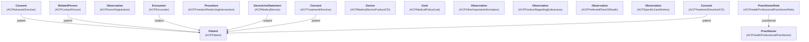

```mermaid
flowchart TB

    %% ---- Profile Definitions ----
    AdvanceDirective["`**Consent**<br>(ACPAdvanceDirective)`"]
    ContactPerson["`**RelatedPerson**<br>(ACPContactPerson)`"]
    DonorRegistration["`**Observation**<br>(ACPDonorRegistration)`"]
    Encounter["`**Encounter**<br>(ACPEncounter)`"]
    FreedomRestrictingIntervention["`**Procedure**<br>(ACPFreedomRestrictingIntervention)`"]
    HealthProfessionalPractitioner["`**Practitioner**<br>(ACPHealthProfessionalPractitioner)`"]
    HealthProfessionalPractitionerRole["`**PractitionerRole**<br>(ACPHealthProfessionalPractitionerRole)`"]
    MedicalDevice["`**DeviceUseStatement**<br>(ACPMedicalDevice)`"]
    MedicalDeviceProductICD["`**Device**<br>(ACPMedicalDeviceProductICD)`"]
    MedicalPolicyGoal["`**Goal**<br>(ACPMedicalPolicyGoal)`"]
    OtherImportantInformation["`**Observation**<br>(ACPOtherImportantInformation)`"]
    Patient["`**Patient**<br>(ACPPatient)`"]
    PositionRegardingEuthanasia["`**Observation**<br>(ACPPositionRegardingEuthanasia)`"]
    PreferredPlaceOfDeath["`**Observation**<br>(ACPPreferredPlaceOfDeath)`"]
    SpecificCareWishes["`**Observation**<br>(ACPSpecificCareWishes)`"]
    TreatmentDirective["`**Consent**<br>(ACPTreatmentDirective)`"]
    TreatmentDirectiveICD["`**Consent**<br>(ACPTreatmentDirectiveICD)`"]

    %% ---- Reference Definitions ----
    AdvanceDirective -- .patient --> Patient
    ContactPerson -- .patient --> Patient
    Encounter -- .subject --> Patient
    HealthProfessionalPractitionerRole -- .practitioner --> HealthProfessionalPractitioner
    MedicalDevice -- .subject --> Patient
    TreatmentDirective -- .patient --> Patient
    TreatmentDirectiveICD -- .patient --> Patient
```
