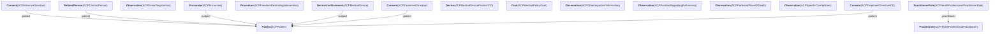

```mermaid
flowchart TB

    %% ---- Profile Definitions ----
    AdvanceDirective["`**Consent**(ACPAdvanceDirective)`"]
    ContactPerson["`**RelatedPerson**(ACPContactPerson)`"]
    DonorRegistration["`**Observation**(ACPDonorRegistration)`"]
    Encounter["`**Encounter**(ACPEncounter)`"]
    FreedomRestrictingIntervention["`**Procedure**(ACPFreedomRestrictingIntervention)`"]
    HealthProfessionalPractitioner["`**Practitioner**(ACPHealthProfessionalPractitioner)`"]
    HealthProfessionalPractitionerRole["`**PractitionerRole**(ACPHealthProfessionalPractitionerRole)`"]
    MedicalDevice["`**DeviceUseStatement**(ACPMedicalDevice)`"]
    MedicalDeviceProductICD["`**Device**(ACPMedicalDeviceProductICD)`"]
    MedicalPolicyGoal["`**Goal**(ACPMedicalPolicyGoal)`"]
    OtherImportantInformation["`**Observation**(ACPOtherImportantInformation)`"]
    Patient["`**Patient**(ACPPatient)`"]
    PositionRegardingEuthanasia["`**Observation**(ACPPositionRegardingEuthanasia)`"]
    PreferredPlaceOfDeath["`**Observation**(ACPPreferredPlaceOfDeath)`"]
    SpecificCareWishes["`**Observation**(ACPSpecificCareWishes)`"]
    TreatmentDirective["`**Consent**(ACPTreatmentDirective)`"]
    TreatmentDirectiveICD["`**Consent**(ACPTreatmentDirectiveICD)`"]

    %% ---- Reference Definitions ----
    AdvanceDirective -- .patient --> Patient
    ContactPerson -- .patient --> Patient
    Encounter -- .subject --> Patient
    HealthProfessionalPractitionerRole -- .practitioner --> HealthProfessionalPractitioner
    MedicalDevice -- .subject --> Patient
    TreatmentDirective -- .patient --> Patient
    TreatmentDirectiveICD -- .patient --> Patient
```
