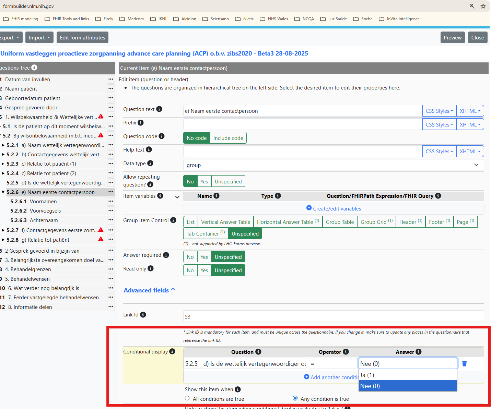

## Development of Questionnaires and QuestionnaireResponses
The source of zib2017-stu3 and zib2020-r4 Questionnaires is outside this IG, namely in FormStudio which has a connection with the ARTDECOR dataset. Therefore, Questionnaires will be saved as JSON, not as FSH.

However, there are a couple of tweaks needed to the FormStudio exported Questionnaires to make them suitable for this IG. The following steps describe the process to create the Questionnaires and QuestionnaireResponses for both zib2017 and zib2020.

### Questionnaire Creation Steps
- Add proper metadata fields (zib2017 follows a similiar pattern). In general we keep the English texts only, adjust the name and title and and an id. See below for an example of the changes needed to the Questionnaire resource:
```json
{
    "name": "Uniform vastleggen proactieve zorgpanning advance care planning (ACP) o.b.v. zibs2020 - Beta3 28-08-2025",
    "title": "Uniform vastleggen proactieve zorgpanning advance care planning (ACP) o.b.v. zibs2020 - Beta3 28-08-2025",
    "resourceType": "Questionnaire",
    "status": "draft",
    "item": [
    ---snip---   
    ],
    "experimental": true,
    "publisher": "Gepubliceerd door PZNL & uitgevoerd door IKNL | Published by PZNL & executed by IKNL",
    "copyright": "Op dit formulier is copyright, gebruikersrechten en een disclaimer van toepassing, zoals die gespecificeerd zijn voor alle informatiestandaarden van IKNL, zie voor de details het onderdeel Gebruikersrechten en disclaimer op https://iknl.nl/onderzoek/eenheid-van-taal. | \nThis form is subject to copyright, user rights and a disclaimer, as specified for all IKNL information standards. For details, see the paragraph on Gebruikersrechten en disclaimer at https://iknl.nl/onderzoek/eenheid-van-taal.",
    "purpose": "Dit formulier is ontwikkeld om afspraken voortkomend uit het proces van proactieve zorgplanning (PZP) eenduidig vast te leggen. | \nThis form was developed to clearly document agreements resulting from the advance care planning (ACP) process.",
    "description": "Dit formulier is ontwikkeld om afspraken voortkomend uit het proces van proactieve zorgplanning (PZP) eenduidig vast te leggen. Het is GEEN afvinklijst. Het kan alleen na deskundig en genuanceerd gesprek door een zorgverlener worden ingevuld. Voor adviezen over het voeren van deze gesprekken word verwezen naar de richtlijn proactieve zorgplanning in de palliatieve fase en Palliaweb, zie https://palliaweb.nl/zorgpraktijk/proactieve-zorgplanning. \nVul 'nog onbekend' in als een onderwerp niet is besproken of als de patiënt (nog) geen mening heeft. Overweeg bij overplaatsing naar een langdurige zorgsetting gespreksverslagen over proactieve zorgplanning aan de overdracht toe te voegen. | \nThis form was developed to clearly document agreements resulting from the advance care planning (ACP) process. It is NOT a checklist. It can only be completed by a healthcare provider after a professional and nuanced conversation. For advice on conducting these conversations, please refer to the guideline for proactive care planning in the palliative phase and Palliaweb, see https://palliaweb.nl/zorgpraktijk/proactieve-zorgplanning. \nEnter 'unknown' if a topic is not discussed or if the patient does not (yet) have an opinion.When transferring to a long-term care setting, consider adding conversation records about advance care planning (ACP) to the transfer documents."
}
```

Needs to be adjusted to:

```json
{
    "resourceType": "Questionnaire",
    "id": "ACP-zib2020",
    "url": "https://api.iknl.nl/docs/pzp/r4/Questionnaire/ACP-zib2020",
    "version": "beta3-20250828",
    "name": "ACPzib2020",    
    "title": "Uniform vastleggen proactieve zorgpanning advance care planning (ACP) o.b.v. zibs2020",
    "status": "draft",
    "experimental": true,
    "publisher": "Published by PZNL & executed by IKNL",
    "copyright": "This form is subject to copyright, user rights and a disclaimer, as specified for all IKNL information standards. For details, see the paragraph on Gebruikersrechten en disclaimer at https://iknl.nl/onderzoek/eenheid-van-taal.",
    "purpose": "This form was developed to clearly document agreements resulting from the advance care planning (ACP) process.",
    "description": "This form was developed to clearly document agreements resulting from the advance care planning (ACP) process. It is NOT a checklist. It can only be completed by a healthcare provider after a professional and nuanced conversation. For advice on conducting these conversations, please refer to the guideline for proactive care planning in the palliative phase and Palliaweb, see https://palliaweb.nl/zorgpraktijk/proactieve-zorgplanning. \nEnter 'unknown' if a topic is not discussed or if the patient does not (yet) have an opinion.When transferring to a long-term care setting, consider adding conversation records about advance care planning (ACP) to the transfer documents.",
    
```
- Add the Questionnaire resources from IKNL form builder into input/resources with the following format "Questionnaire-[id].json"
- Using https://formbuilder.nlm.nih.gov/ fix the conditional expressions in the Questionnaires. This goes wrong for all boolean conditional displays.
  - Select "Start with existing form" and "Import from local file". 
  - The Form builder shows warnings for conditions that are not valid FHIRPath expressions.
    - For example: "_5.2.6 e) Naam eerste contactpersoon_" need to be set so that: 
     5.2.5 - d) Is de wettelijk vertegenwoordiger ook de eerste contactpersoon? = `Nee (0)`
     
  - Set all the treatment codes of the section '4. Behandelgrenzen' and measurement names of the section '5. Behandelwensen' and treatment codes to:
    - Read only = Yes
    - Value method = Pick initial value
    - This makes it way easier to create QuestionnaireResponses later on. Here is an example of how the endresult json should look like:
    ```json
    {
          "type": "choice",
          "linkId": "1408",
          "text": "Belangrijkste doel van behandeling ([MetingNaam])",
          "required": false,
          "repeats": false,
          "readOnly": true,
          "answerOption": [
            {
              "valueCoding": {
                "system": "http://snomed.info/sct",
                "code": "180771000146100",
                "display": "Focus van behandeling (waarneembare entiteit)"
              },
              "initialSelected": true
            }
          ]
        },
    ``` 
  - Once ready, go to the top right and select "Export" then "Export to file in FHIR R4 format" (or STU3) and save the contents over the file created in input/resources. 

### QuestionnaireResponse Creation Steps
To create QuestionnaireResponses we use https://lhcforms.nlm.nih.gov/lhcforms/. Here you will load the adjusted Questionnaire from above and fill in some example data.

- Load From File: Select the adjusted Questionnaire from above.
- Fill in example data.
- Once done, select "Show Form Data as FHIR SDC QuestionnaireResponse".
- Copy to clipboard and save as "QuestionnaireResponse-[PatientName]-[Date].json" in input/resources. For example "QuestionnaireResponse-Jansen-20250828.json".

